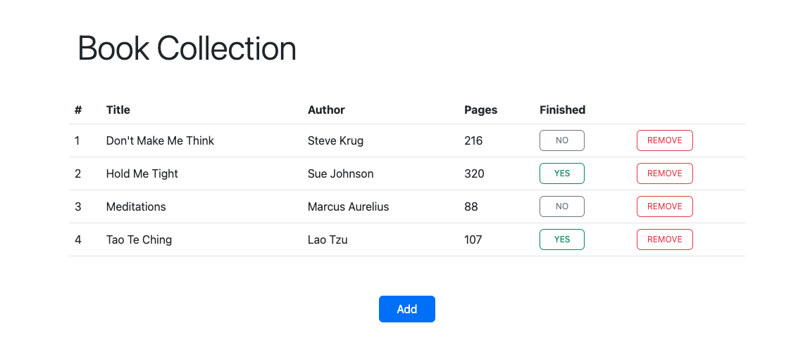

# Book Collection

[Check live](https://mrzadzinski.github.io/book-collection/)

Simple web app to create your book collection

(Several predefined examples to play with are provided)

(There is no data storage for long term use)

## Technologies
* JavaScript
* CSS
* HTML
* Bootstrap

## Skills practiced
* Object constructors
* Accessing objects and utilizing their data
* Targeting DOM elements through ancestor/descendant relations
* Bootstrap
    * Understanding basic components
    * Creating modal with form inside

## Acknowledgments
* This project was an assignment from The Odin Project course:
  * [Library](https://www.theodinproject.com/lessons/node-path-javascript-library) project

